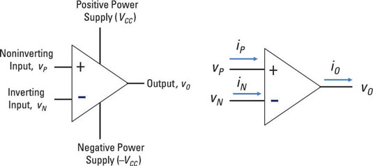
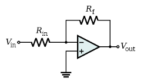
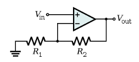
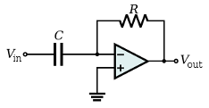

# Introduction

Op Amps, also known as Operational Amplifier, is a cheap integrated circuit that can be used as a building block of electronics. It is an amplifier with a large open loop gain. It has an inverting input and a non-inverting input, and a single output. The relationship between the input and the output depends upon the feedback network that connects them. \
An op amp performs operations on an input signal. Some of the possible operations include amplification, buffering, integration, differentiation, addition, and subtraction. When used in an open loop, the op amp has poor stability and very high gain (infinite for an ideal op amp). In a closed loop, the feedback adds stability and reduces the gain of the amplifier.

   
  Figure 1: In an op amp there is always a positive voltage input and a negative voltage input. An op amp with – (inverting) and + (non-inverting) inputs. If the positive voltage input is up, then the voltage output is positive. If the negative voltage input is up, then the voltage output is negative. Inverting symbols go in the opposite directions and Non-inverting doe the opposite. Current for an ideal op amp is zero.

First rule:\
$V_1=V_2$

the op amp changes its output to lower the voltage difference between its inputs to zero.\
Second rule:\
$I_1=I_2=0$

the inputs draw no current and are essentially connected to an open circuit.
The resulting output from voltage applied within both voltages:
$V_o=A(V^+ - V^-)$
$V_o=AV_{in}$

In an op amp, based of equation(2), makes the output voltage:\
$A=\frac{V_o}{V_{in}}$

Based of that, the amplifier will be able to change the voltage of the output compared to the input. Since the amplifier is connected to the power supply; thus, accounting for the difference of energy of input and output. The amplifier is connected to the positive and negative power supply.\

Inverting amplifier comes from the input of inverting, where the negative charge goes through this Figure 2.\

   
  Figure 2: This is an inverting amplifier circuit.

The output of the inverting amplifier is equal to $-\frac{R_f}{R_{in}}$ times the input signal since the negative input is high. The input of op amps draws no current; meaning that the current flowing in resistor $R_{in}$ and $R_f$ is the same. With the help of Ohm's law:

$\frac{V_o}{R_f}=\frac{-V_{in}}{R_{in}}$
$A=\frac{V_o}{V_{in}}=\frac{-R_f}{R_{in}}$

The non-inverting amplifier is opposite to the inverting one. The input resistor $R_1$ is grounded. Following rules (1) and (2), (2) tries to drive the current to zero at the intersection between $R_1$ and $R_2$ (Figure 3), and (1) makes the voltage equal to the input voltage. Leading to:

$\frac{V_{in}}{R_1}=\frac{V_{o}-V_{in}}{R_2}$
$\frac{R_2}{R_1}=\frac{V_{o}-V_{in}}{V_{in}}=\frac{V_{o}}{V_{in}}-1$
$A=\frac{V_{o}}{V_{in}}=\frac{R_2}{R_1}+1$
    

   
  Figure 3: A non-inverting amplifier circuit. The input resistor $R_1$ is grounded.

Inverting Differentiator or differentiating amplifier consists of capacitor $C$ at the input and a resistor $R$. The current flowing through the capacitor $C$ is given by:

$I=C\frac{dV}{dt}=C\dot V$

Where $I$ is the current through capacitor, $V$ is the voltage across the capacitor, and $dV/dt$ is the rate of change through the capacitor.\
The current can also be represented with ohm's law:

$I=\frac{V}{R}$

Using the current law equation (2)

$I_o=I_{in}$
$I_o=\frac{0-V_o}{R} \text{ and } I_{in}=C\frac{dV_{in}}{dt}$
$\frac{-V_o}{R}=C\frac{dV_{in}}{dt}$
$V_o=-RC\frac{dV_{in}}{dt}$

There will be some small resistance $R_{in}$ in series with the capacitor, and the differentiator will only work at frequencies below $\omega_C=\frac{1}{R_{in}C}$.

   
  Figure 4: An idea inverting differentiator circuit.

Inverting Integrator consists of resistor $R$ at the input and a capacitor, the reverse of the differentiating amplifier. Same principle as the inverting differentiator, the intersection/node between the resistor and amplifier, the potential at the node is zero. Using current law:

$I_{in}=I_o$
$I_{in}=\frac{V_{in}-0}{R}=\frac{V_{in}}{R}$

The current over the capacitor is similar to the differentiating amplifier:

$I_o=C\frac{d(0-V_o)}{dt}=-C\frac{dV_o}{dt}$

$\frac{V_{in}}{R}=-C\frac{dV_o}{dt}$

$-\frac{V_{in}dt}{RC}=dV_o=\int^{V_o}_0dV_o=V_o$

$V_o=-\frac{1}{RC}\int^t_0 V_{in} dt$

   
  Figure 5: An ideal inverting integrator circuit.

The behavior of the device can be improved by adding a resistor $R_f$ in parallel with the capacitor. This does not come without a tradeoff, however, as it prevents the circuit from integrating at all frequencies. In practice, with the resistor in place, the integrator will work at frequencies above $\omega_C=\frac{1}{R_fC}$.

